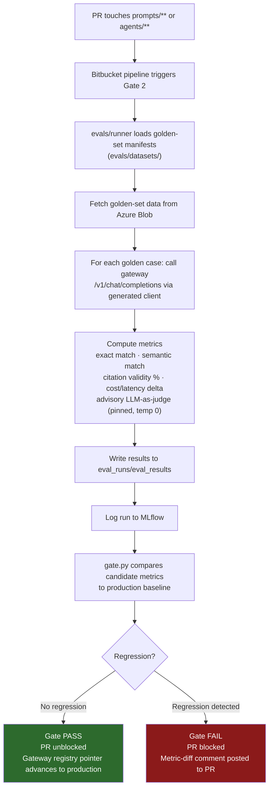

# Eval-Gate Flow (Gate 2)

Gate 2 Bitbucket pipeline: runs on every PR touching prompts or agents, blocks merges on metric regression.

```mermaid
flowchart TD
    A["PR touches prompts/** or agents/**"] --> B["Bitbucket pipeline triggers Gate 2"]
    B --> C["evals/runner loads golden-set manifests\n(evals/datasets/)"]
    C --> D["Fetch golden-set data from Azure Blob"]
    D --> E["For each golden case: call gateway\n/v1/chat/completions via generated client"]
    E --> F["Compute metrics\nexact match · semantic match\ncitation validity % · cost/latency delta\nadvisory LLM-as-judge (pinned, temp 0)"]
    F --> G["Write results to eval_runs/eval_results"]
    G --> H["Log run to MLflow"]
    H --> I["gate.py compares candidate metrics\nto production baseline"]
    I --> J{Regression?}
    J -- No regression --> K["Gate PASS\nPR unblocked\nGateway registry pointer advances to production"]
    J -- Regression detected --> L["Gate FAIL\nPR blocked\nMetric-diff comment posted to PR"]

    style K fill:#2d6a2d,color:#fff
    style L fill:#8b1a1a,color:#fff
```
