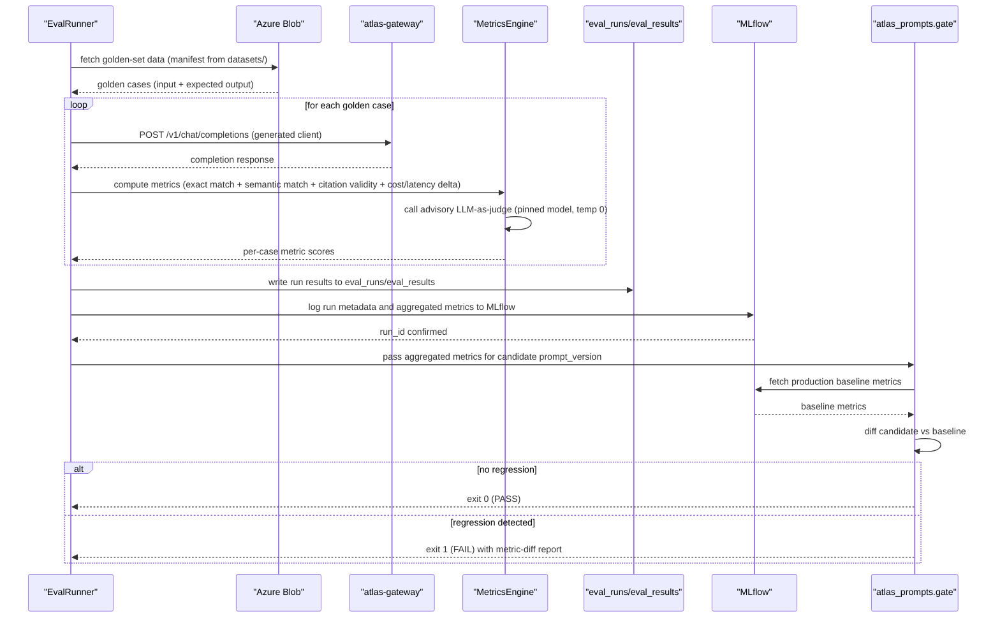

# Eval Runner Sequence

End-to-end sequence: golden-set load through gateway calls, metric computation, storage, and gate verdict.

```mermaid
sequenceDiagram
    participant R as "EvalRunner"
    participant B as "Azure Blob"
    participant G as "atlas-gateway"
    participant M as "MetricsEngine"
    participant DB as "eval_runs/eval_results"
    participant ML as "MLflow"
    participant GT as "atlas_prompts.gate"

    R->>B: fetch golden-set data (manifest from datasets/)
    B-->>R: golden cases (input + expected output)

    loop for each golden case
        R->>G: POST /v1/chat/completions (generated client)
        G-->>R: completion response
        R->>M: compute metrics (exact match + semantic match + citation validity + cost/latency delta)
        M->>M: call advisory LLM-as-judge (pinned model, temp 0)
        M-->>R: per-case metric scores
    end

    R->>DB: write run results to eval_runs/eval_results
    R->>ML: log run metadata and aggregated metrics to MLflow
    ML-->>R: run_id confirmed

    R->>GT: pass aggregated metrics for candidate prompt_version
    GT->>ML: fetch production baseline metrics
    ML-->>GT: baseline metrics
    GT->>GT: diff candidate vs baseline
    alt no regression
        GT-->>R: exit 0 (PASS)
    else regression detected
        GT-->>R: exit 1 (FAIL) with metric-diff report
    end
```
