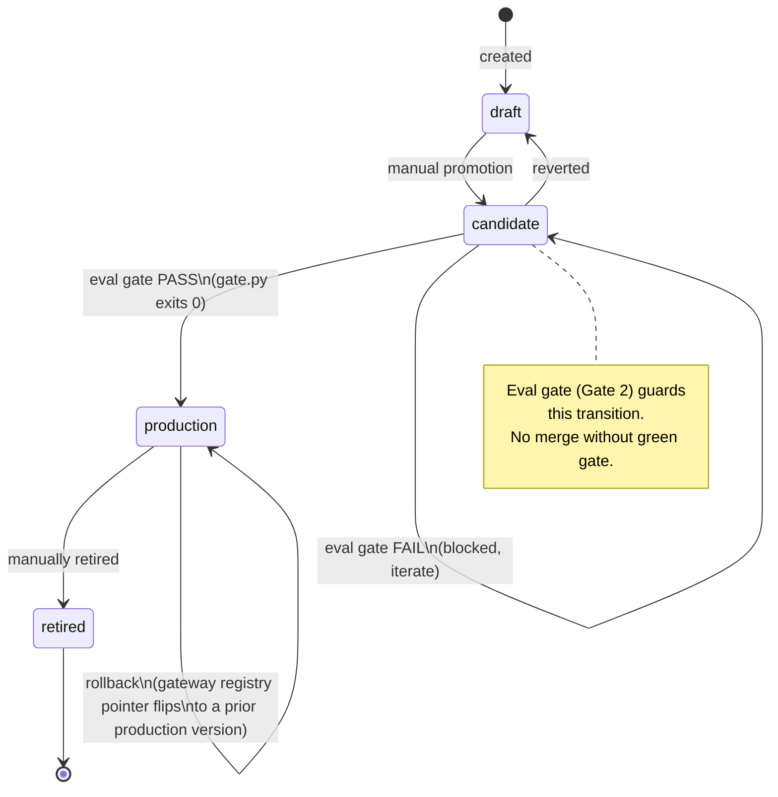

# Prompt Version Lifecycle

State diagram for a prompt_version: statuses are draft, candidate, production, and retired.

```mermaid
stateDiagram-v2
    [*] --> draft : created

    draft --> candidate : manual promotion
    candidate --> draft : reverted

    candidate --> production : eval gate PASS\n(gate.py exits 0)
    candidate --> candidate : eval gate FAIL\n(blocked, iterate)

    production --> retired : manually retired

    production --> production : rollback\n(gateway registry pointer flips\nto a prior production version)

    retired --> [*]

    note right of candidate
        Eval gate (Gate 2) guards
        this transition.
        No merge without green gate.
    end note
```
